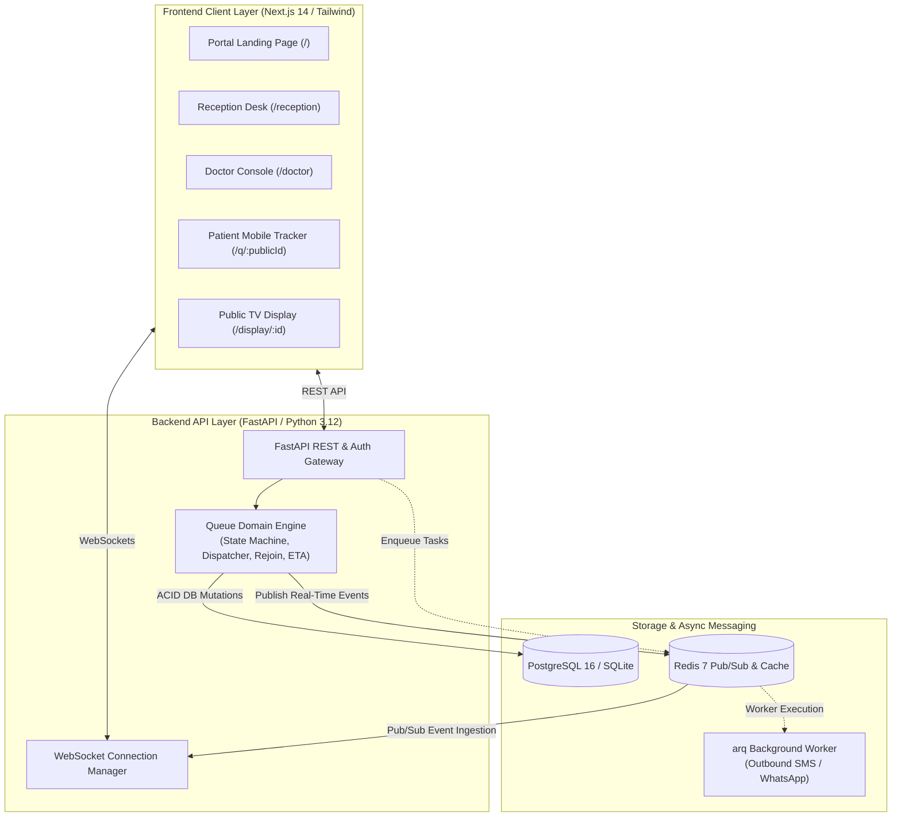

# 🏥 HQMS — Smart Hospital Virtual Queue & Token Management Platform

[](https://fastapi.tiangolo.com)
[](https://nextjs.org)
[](https://www.postgresql.org)
[](https://redis.io)
[](https://www.typescriptlang.org)
[](https://tailwindcss.com)

> **Eliminating overcrowded outpatient waiting rooms with statistical wait predictions, 1-click clinical workflows, zero-install mobile live queue tracking, and real-time WebSocket synchronization.**

---

## 🌟 Core Product Highlights

- **📱 Zero-Install Patient Live Queue**: Patients track their turn on mobile web via unguessable, secure public URLs sent via SMS/WhatsApp without app downloads or login barriers.
- **⏱️ Statistical Wait-Time Estimation**: Windowed predictions (e.g. `15–25 mins`) calculated from live doctor consultation pacing and pause dilation rather than deceptive static timestamps.
- **🩺 1-Click Doctor Pacing Console**: Designed for busy physicians. Click `Complete & Call Next` to atomically finish the current consultation and advance the queue.
- **🖨️ Receptionist Walk-In Desk**: Instant walk-in registration (<5 seconds), priority classification (`Normal`, `High`, `Emergency`), and thermal-formatted printable token slips with QR codes.
- **📺 Public TV Waiting Board**: High-contrast, privacy-safe display for waiting area wall-mounted screens (no patient names or sensitive diagnostic details exposed).
- **🔒 Deterministic Queue Engine**: Pessimistic row-level database locking (`with_for_update`) guarantees zero sequence number collisions or race conditions under high concurrent staff actions.
- **⚡ Real-Time WebSocket Infrastructure**: Redis Pub/Sub backplane broadcasts queue events instantly across multi-worker deployments.

---

## 🏛️ System Architecture



---

## 🚀 Live Demo & Station URLs

When running locally:

| Station / Interface | URL | Role / Purpose |
| :--- | :--- | :--- |
| **🏠 Portal Home** | [`http://localhost:3000`](http://localhost:3000) | Landing page with direct links to all station consoles |
| **🔐 Staff Sign In** | [`http://localhost:3000/login`](http://localhost:3000/login) | Staff login with 1-click demo credential pills |
| **📋 Reception Desk** | [`http://localhost:3000/reception`](http://localhost:3000/reception) | Walk-In registration, live table & token slip printing |
| **🩺 Doctor Console** | [`http://localhost:3000/doctor`](http://localhost:3000/doctor) | 1-click consultation pacing, elapsed timer & pause controls |
| **📺 Public TV Board** | [`http://localhost:3000/display/demo`](http://localhost:3000/display/demo) | Fullscreen privacy-safe waiting room display |
| **📖 Swagger Docs** | [`http://127.0.0.1:8000/api/v1/docs`](http://127.0.0.1:8000/api/v1/docs) | Interactive OpenAPI 3.0 backend documentation |

### 🔑 Demo Login Credentials

- **Receptionist**: `reception@hospital.com` / `Recep123!`
- **Doctor**: `doctor@hospital.com` / `Doctor123!`

*(The `/login` screen includes instant 1-click autofill buttons for these credentials).*

---

## 🛠️ Quickstart Guide

### Option A: Local Standalone Development (Zero External Dependencies)

#### 1. Backend Setup
```bash
# In project root
python -m venv venv
venv\Scripts\activate  # Windows: venv\Scripts\activate | Unix: source venv/bin/activate
pip install -r backend/requirements.txt

# Start FastAPI server on port 8000 (auto-seeds demo hospital and queues on first boot)
python -m uvicorn app.main:app --app-dir backend --port 8000 --reload
```

#### 2. Frontend Setup
```bash
# In frontend directory
cd frontend
npm install
npm run dev
# Open http://localhost:3000 in your browser
```

---

### Option B: Docker Compose Multi-Container Deployment

```bash
# Start PostgreSQL 16, Redis 7, Backend, and Worker
docker compose up -d
```

---

## 🧪 Testing & Verification

The test suite covers:
1. Domain state machine invariants & terminal transitions
2. Dispatcher priority ordering (`EMERGENCY` > `HIGH` > `NORMAL`) & presence bypass
3. Rejoin policy mathematical offset calculations
4. Statistical ETA window bounds and pause dilation
5. Real-time WebSocket authentication, heartbeats & Redis broadcasting
6. Staff API workflows (Hospital Admin $\rightarrow$ Receptionist $\rightarrow$ Doctor)
7. Public patient live token viewing and self-actions
8. Concurrency & pessimistic row-level locking stress verification

Run the complete test suite:
```bash
python -m pytest backend/tests -v
```

---

## 📂 Project Repository Structure

```
HQMS/
├── backend/
│   ├── alembic/                       # Async database migrations
│   ├── app/
│   │   ├── api/
│   │   │   ├── deps.py                # JWT & RBAC security dependencies
│   │   │   └── v1/
│   │   │       ├── endpoints/         # Auth, Hospitals, Queues, Reception, Doctor, Patient
│   │   │       └── router.py          # Unified v1 router
│   │   ├── core/
│   │   │   ├── config.py              # Pydantic Settings
│   │   │   ├── database.py            # Async SQLAlchemy engine & session factory
│   │   │   ├── redis.py               # Redis client pool
│   │   │   └── security.py            # Password hashing & JWT claims
│   │   ├── domain/
│   │   │   ├── notifications/         # Pluggable notification engine & vendor adapters
│   │   │   └── queue/                 # Core deterministic queue domain engine
│   │   ├── models/                    # 11 core SQLAlchemy 2.0 domain models
│   │   ├── schemas/                   # Pydantic v2 request/response models
│   │   ├── websockets/                # WebSocket connection manager & Redis publisher
│   │   ├── workers/                   # arq background worker tasks & settings
│   │   └── main.py                    # Application factory & lifespan bootstrap
│   └── tests/                         # Unit and integration test suites (26 passing tests)
├── frontend/
│   ├── src/
│   │   ├── app/
│   │   │   ├── (auth)/login/          # Staff sign-in page
│   │   │   ├── (dashboard)/
│   │   │   │   ├── doctor/            # Doctor consultation console
│   │   │   │   └── reception/         # Reception desk & token slip print modal
│   │   │   ├── display/[id]/          # Public waiting room TV screen
│   │   │   ├── q/[publicId]/          # Patient mobile live tracking view
│   │   │   ├── globals.css            # Tailwind directives & glassmorphism utilities
│   │   │   ├── layout.tsx             # Root layout
│   │   │   └── page.tsx               # Portal entry landing page
│   │   ├── hooks/                     # useQueueWebSocket auto-reconnecting hook
│   │   ├── lib/                       # Typed api.ts REST client
│   │   └── types/                     # TypeScript domain models
│   ├── tailwind.config.ts             # Custom healthcare design tokens
│   └── package.json
├── docker-compose.yml                 # PostgreSQL 16 & Redis 7 stack
└── README.md
```

---

## 📜 License
Licensed under the [MIT License](LICENSE).
