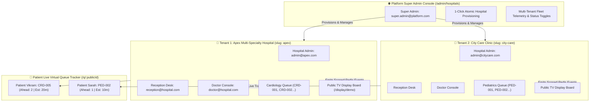

# 🏥 HQMS — Multi-Tenant Smart Hospital Virtual Queue & SaaS Platform

[](https://github.com/Frpratik/HQMS)
[](https://fastapi.tiangolo.com)
[](https://nextjs.org)
[](https://www.postgresql.org)
[](https://redis.io)
[](https://www.typescriptlang.org)
[](https://tailwindcss.com)
[](#-testing--verification)

> **Enterprise-grade Multi-Tenant B2B SaaS platform for hospital virtual queueing, automated 1-click tenant onboarding, statistical wait predictions, clinical pacing, zero-install mobile live queue tracking, and namespaced real-time WebSocket synchronization.**

---

## 🌟 Core Product Highlights

- **🏢 Multi-Tenant Data & Security Isolation**: Run hundreds of hospitals on a single shared codebase with absolute tenant data isolation, independent token sequence counters, and scoped RBAC boundaries.
- **🌐 Platform Super Admin Console**: 1-click atomic hospital provisioning, instant admin credential generation, tenant suspension controls, and real-time fleet health telemetry.
- **🏥 Hospital Admin Self-Management Suite**: Hospital-level configuration of clinical branches, departments, consultation rooms, doctor invitations, and live OPD queue deployments.
- **📱 Zero-Install Patient Live Queue**: Patients track their turn on mobile web via unguessable, secure public URLs sent via SMS/WhatsApp without app downloads or login barriers.
- **⏱️ Statistical Wait-Time Estimation**: Windowed predictions (e.g. `15–25 mins`) calculated from live doctor consultation pacing and pause dilation rather than deceptive static timestamps.
- **🩺 1-Click Doctor Pacing Console**: Designed for busy physicians. Click `Complete & Call Next` to atomically finish the current consultation and advance the queue.
- **🖨️ Receptionist Walk-In Desk**: Instant walk-in registration (<5 seconds), priority classification (`Normal`, `High`, `Emergency`), and thermal-formatted printable token slips with QR codes.
- **📺 Public TV Waiting Board**: High-contrast, privacy-safe display for waiting area wall-mounted screens with hospital tenant branding.
- **🔒 Deterministic Queue Engine**: Pessimistic row-level database locking (`with_for_update`) guarantees zero sequence number collisions or race conditions under high concurrent staff actions.
- **⚡ Namespaced WebSocket Infrastructure**: Redis Pub/Sub backplane broadcasts queue events on tenant-isolated channels (`tenant:{hospital_id}:queue:{queue_id}:*`).

---

## 🏛️ Multi-Tenant System Architecture



---

## 🚀 Live Demo & Station Portals

When running locally:

| Station / Interface | URL | Role / Credentials | Purpose |
| :--- | :--- | :--- | :--- |
| **🌐 Super Admin Console** | [`/admin/hospitals`](http://localhost:3000/admin/hospitals) | `super.admin@platform.com`<br>`supersecurepass` | Multi-tenant hospital fleet overview & 1-click provisioning |
| **🏥 Hospital Admin** | [`/admin/departments`](http://localhost:3000/admin/departments) | `admin@apex.com`<br>`Admin123!` | Department setup, rooms, staff onboarding & queues |
| **📋 Reception Desk** | [`/reception`](http://localhost:3000/reception) | `reception@hospital.com`<br>`Recep123!` | Walk-in triage, priority tagging & token slip printing |
| **🩺 Doctor Console** | [`/doctor`](http://localhost:3000/doctor) | `doctor@hospital.com`<br>`Doctor123!` | 1-click consultation pacing, elapsed timer & pause controls |
| **📺 Public TV Board** | [`/display/demo`](http://localhost:3000/display/demo) | *No Login Required* | Fullscreen privacy-safe waiting room display |
| **📱 Patient Live Tracker** | [`/q/:publicId`](http://localhost:3000/q/demo) | *No Login Required* | Real-time ETA, "Away", "Returning", "Ready" presence |
| **🔐 Unified Sign In** | [`/login`](http://localhost:3000/login) | *Interactive 4-Role Demo Pills* | Fast 1-click test credential switching |
| **📖 Swagger Docs** | [`http://127.0.0.1:8000/api/v1/docs`](http://127.0.0.1:8000/api/v1/docs) | *Interactive OpenAPI 3.0 UI* | Interactive backend API documentation |

---

## 🛠️ Quickstart Guide

### Option A: Local Development

#### 1. Backend Setup
```bash
# In project root
python -m venv venv
venv\Scripts\activate  # Windows: venv\Scripts\activate | Unix: source venv/bin/activate
pip install -r backend/requirements.txt

# Start FastAPI server on port 8000 (auto-seeds demo hospital, accounts, and queues)
python -m uvicorn app.main:app --app-dir backend --port 8000 --reload
```

#### 2. Frontend Setup
```bash
# In frontend directory
cd frontend
npm install
npm run dev
# Open http://localhost:3000 in your browser
```

---

### Option B: Docker Compose Multi-Container Deployment

```bash
# Start PostgreSQL 16, Redis 7, FastAPI Backend, and Background Worker
docker compose up -d
```

---

## 🧪 Testing & Verification

The comprehensive test suite covers:
1. **Multi-Tenant Isolation**: Verified zero cross-tenant queue access and independent token sequence counters.
2. **Platform Provisioning**: 1-click atomic creation of hospitals, initial branches, departments, rooms, and admin accounts.
3. **Hospital Admin Self-Management**: Scoped department, room, staff invitation, and queue creation.
4. **WebSocket Channel Namespacing**: Multi-tenant Redis channel routing and staff channel JWT authentication.
5. **Deterministic Queue Engine**: State machine invariants, priority ordering (`EMERGENCY` > `HIGH` > `NORMAL`), away-presence bypass, and mathematical rejoin offsets.
6. **Concurrency Stress Tests**: High-frequency concurrent token creation and doctor pacing.

Run the test suite:
```bash
# Backend pytest suite (32 tests passing)
python -m pytest backend/tests -v

# Frontend TypeScript typecheck (0 errors)
cd frontend && npx tsc --noEmit

# End-to-End automated 12-station verification
python -u scripts/verify_e2e_frontend.py
```

---

## 📂 Project Repository Structure

```
HQMS/
├── backend/
│   ├── alembic/                       # Async database migrations
│   ├── app/
│   │   ├── api/
│   │   │   ├── deps.py                # JWT, RBAC & Multi-Tenant security dependencies
│   │   │   └── v1/
│   │   │       ├── endpoints/         # Platform, Hospital Admin, Auth, Reception, Doctor, Patient
│   │   │       └── router.py          # Unified v1 router
│   │   ├── core/
│   │   │   ├── config.py              # Pydantic Settings
│   │   │   ├── database.py            # Async SQLAlchemy engine & session factory
│   │   │   ├── redis.py               # Redis client pool
│   │   │   └── security.py            # Password hashing & JWT claims with tenant context
│   │   ├── domain/
│   │   │   ├── notifications/         # Pluggable notification engine & vendor adapters
│   │   │   └── queue/                 # Deterministic queue domain engine & ETA calculator
│   │   ├── models/                    # Multi-tenant SQLAlchemy 2.0 domain models
│   │   ├── schemas/                   # Pydantic v2 schemas (Platform, Hospital Admin, Queue, Patient)
│   │   ├── websockets/                # Tenant-namespaced WebSocket connection manager & Redis publisher
│   │   ├── workers/                   # arq background worker tasks & settings
│   │   └── main.py                    # Application factory, lifespan bootstrap & startup seed
│   └── tests/                         # Unit and integration test suites (32 passing tests)
├── frontend/
│   ├── src/
│   │   ├── app/
│   │   │   ├── (auth)/login/          # Staff sign-in page with 4-role demo pills
│   │   │   ├── (dashboard)/
│   │   │   │   ├── admin/
│   │   │   │   │   ├── hospitals/     # Platform Super Admin fleet dashboard
│   │   │   │   │   └── departments/   # Hospital Admin self-management console
│   │   │   │   ├── doctor/            # Doctor consultation console
│   │   │   │   └── reception/         # Reception desk & token slip print modal
│   │   │   ├── display/[id]/          # Public waiting room TV screen
│   │   │   ├── q/[publicId]/          # Patient mobile live tracking view with dynamic branding
│   │   │   ├── globals.css            # Tailwind directives & glassmorphism utilities
│   │   │   ├── layout.tsx             # Root layout
│   │   │   └── page.tsx               # Portal entry landing page
│   │   ├── hooks/                     # useQueueWebSocket auto-reconnecting hook
│   │   ├── lib/                       # Typed api.ts REST client with multi-tenant endpoints
│   │   └── types/                     # TypeScript domain models
│   ├── tailwind.config.ts             # Custom healthcare design tokens
│   └── package.json
├── scripts/
│   ├── verify_e2e_frontend.py         # 12-Station automated end-to-end verification suite
│   └── migrate_sqlite.py              # SQLite schema migration utility
├── docker-compose.yml                 # PostgreSQL 16 & Redis 7 stack
└── README.md
```

---

## 📜 License
Licensed under the [MIT License](LICENSE).
