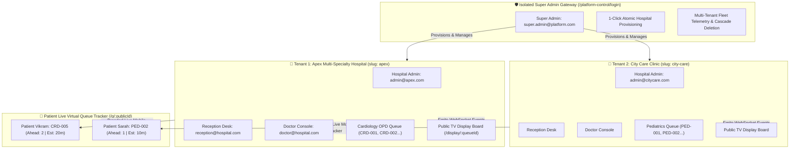

# 🏥 HQMS — Multi-Tenant Smart Hospital Virtual Queue & Healthcare SaaS

[](https://github.com/Frpratik/HQMS)
[](https://fastapi.tiangolo.com)
[](https://nextjs.org)
[](https://www.postgresql.org)
[](https://www.typescriptlang.org)
[](https://tailwindcss.com)
[-success.svg)](#-automated-test-suite)

> **Enterprise-grade Multi-Tenant Healthcare SaaS for hospital virtual queueing, automated 1-click tenant onboarding, statistical wait predictions, clinical consultation pacing, zero-install mobile live queue tracking, and real-time WebSocket synchronization.**

---

## 🌟 Core Product Capabilities

- **🏢 Multi-Tenant Data & Security Isolation**: Manage unlimited hospital tenants on a single shared codebase with absolute data isolation, independent token sequence counters, and scoped RBAC boundaries.
- **🛡️ Isolated Super Admin Platform Gateway**: Secret master portal (`/platform-control/login`) with 1-click hospital provisioning, metadata editing, tenant suspension, and cascade deletion.
- **🏥 Hospital Admin Full CRUD Operations Suite**: Self-service management with complete Create, Read, Update, and Delete (CRUD) controls for clinical departments, consultation rooms, doctor/receptionist directory & password resets, and live OPD queue deployments.
- **✉️ Automated Single-Email Dispatch Engine**: Built-in Gmail SMTP engine sending welcome emails to new hospital admins and role-specific invitation credentials to Doctors & Receptionists.
- **📱 Zero-Install Patient Live Queue Tracker**: Patients track their turn on mobile web via unguessable, secure public URLs (`/q/:publicId`) with live ETA windows, audio chimes, and "Stepping Away" / "Returning" presence signals.
- **🩺 1-Click Doctor Workstation**: Fast consultation flow (`CALL PATIENT`, `Start Serving`, `Complete`, `Skip`, `Did Not Appear`). Automatically resumes paused queues when calling patients.
- **🖨️ Receptionist Walk-In Desk**: Instant patient registration (<5 seconds), priority classification (`Normal`, `High`, `Emergency`), and thermal-formatted printable token slips with QR codes.
- **📺 Public TV Waiting Board**: High-contrast, privacy-safe display (`/display/:id`) for waiting area wall-mounted screens with hospital tenant branding and live queue tickers.
- **🔒 Deterministic Queue Engine & FSM**: Finite State Machine with pessimistic database locking (`with_for_update`) guarantees zero sequence collisions or race conditions under high concurrent staff actions.
- **⚡ Namespaced WebSocket Infrastructure**: Real-time broadcast engine syncing Doctors, Receptionists, TV Displays, and Mobile Trackers instantly.

---

## 🏛️ System Architecture



---

## 🚀 Workstation Portals & Credentials

When running locally:

| Station / Interface | URL | Access / Role | Purpose |
| :--- | :--- | :--- | :--- |
| **🌐 Public Landing & Patient Tracker** | [`http://localhost:3000/`](http://localhost:3000/) | *Public* | Patient tracker lookup & system overview |
| **🛡️ Super Admin Master Gateway** *(Secret)* | [`http://localhost:3000/platform-control/login`](http://localhost:3000/platform-control/login) | `super.admin@platform.com`<br>`supersecurepass` | Multi-tenant hospital fleet management |
| **🔐 Staff Workstation Login** | [`http://localhost:3000/login`](http://localhost:3000/login) | *Hospital Staff* | Unified sign-in for Doctors, Receptionists & Admins |
| **🏥 Hospital Admin Console** | [`http://localhost:3000/admin/departments`](http://localhost:3000/admin/departments) | `admin@apex.com`<br>`Admin123!` | Department setup, rooms, staff & OPD queues |
| **🩺 Doctor Workstation** | [`http://localhost:3000/doctor`](http://localhost:3000/doctor) | `doctor@hospital.com`<br>`Doctor123!` | Real-time consultations, 1-click calling & patient skip |
| **👥 Reception Desk** | [`http://localhost:3000/reception`](http://localhost:3000/reception) | `reception@hospital.com`<br>`Recep123!` | Walk-in intake, priority triage & thermal token printing |
| **📺 Public TV Waiting Board** | [`http://localhost:3000/display/:id`](http://localhost:3000/display/demo) | *No Login Required* | Fullscreen privacy-safe waiting room display |
| **📱 Patient Mobile Tracker** | [`http://localhost:3000/q/:publicId`](http://localhost:3000/q/demo) | *No Login Required* | Live wait time, queue position & step-away controls |
| **⚡ Interactive Swagger API Docs** | [`http://127.0.0.1:8000/api/v1/docs`](http://127.0.0.1:8000/api/v1/docs) | *FastAPI OpenAPI 3.0* | Interactive API endpoint explorer |

---

## 🛠️ Quickstart & Development

### 1. Backend Setup
```bash
# In project root
python -m venv venv
venv\Scripts\activate  # Windows: venv\Scripts\activate | macOS/Linux: source venv/bin/activate
pip install -r backend/requirements.txt

# Start FastAPI backend (Port 8000)
python -m uvicorn app.main:app --app-dir backend --host 127.0.0.1 --port 8000 --reload
```

### 2. Frontend Setup
```bash
cd frontend
npm install

# Start Next.js frontend (Port 3000)
npm run dev
```

---

## 🧪 Automated Test Suite

The test suite covers full multi-tenant isolation, 1-click provisioning, role-based access control, queue state transitions, concurrent token locking, and WebSocket synchronization.

```bash
# Run all 34 integration & unit tests
python -m pytest backend/tests -v
```

```
======================= 34 passed in 18.06s =======================
```

---

## 🔑 Environment Variables Configuration

Create a `.env` file in the root and `backend/` directory:

```env
# Application
ENVIRONMENT=development
PROJECT_NAME="HQMS - Smart Hospital Virtual Queue"
DATABASE_URL=sqlite+aiosqlite:///./hqms_local.db  # Or PostgreSQL: postgresql+asyncpg://...
FRONTEND_URL=http://localhost:3000

# Live Gmail SMTP Engine
SMTP_HOST=smtp.gmail.com
SMTP_PORT=587
SMTP_USER=your_email@gmail.com
SMTP_PASSWORD=your_gmail_app_password
SMTP_TLS=true
# Notifications
NOTIFICATION_PROVIDER=mock
```

---

## 📄 License
MIT License. Built for hospitals, healthcare systems, and clinical networks.
